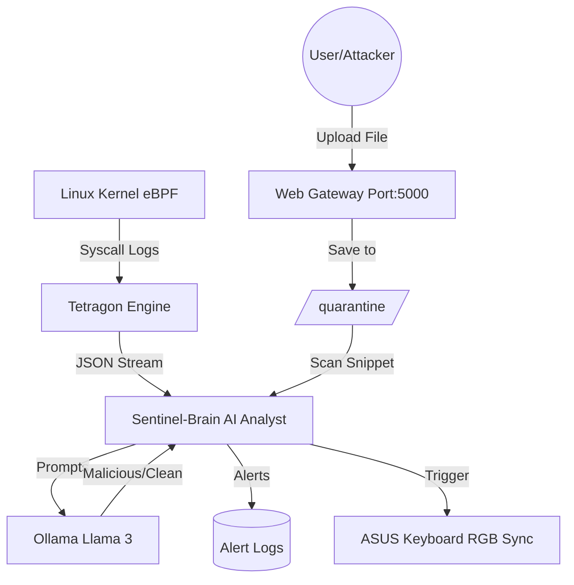

# 🛡️ Nexus-Cyber: AI-Powered Autonomous Security Stack


**Nexus-Cyber** is an advanced, autonomous security monitoring system designed for **ASUS TUF Gaming** laptops running **Pop!_OS**. It combines low-level kernel observability with modern Large Language Models (LLMs) and physical hardware feedback to create a truly interactive defense environment.

---

## 🚀 Key Features

### 🔍 1. Tetragon eBPF Monitoring
The system hooks into the Linux kernel using **Cilium Tetragon**. It monitors critical syscalls in real-time, specifically:
- `sys_openat`: Tracking every file access attempt.
- `sys_connect`: Monitoring all outgoing network connections.
Logs are exported in JSON format for instant AI processing.

### 🧠 2. Sentinel-Brain (AI Analyst)
The "brain" of the operation. A custom Python engine that reads Tetragon logs and feeds them into **Ollama (Llama 3)**.
- **Real-time Classification**: Every log entry is analyzed by AI.
- **Threat Labeling**: AI classifies events as `CLEAN` or `MALICIOUS`.
- **Automated Logging**: Suspicious activities are instantly recorded in `/logs/alerts.txt`.

### 🚨 3. Hardware-Alert Sync (The "Cool" Factor)
Integrated directly with **`asusctl`**. If the AI detects a `MALICIOUS` intent, your laptop's physical keyboard will instantly:
- 🔴 **Flash Red**: Visual warning of an active threat.
- 🔵 **Return to Blue**: When the environment is safe.

### 🌐 4. The Universal Bridge (Web Gateway)
A built-in **Flask** web server that allows any device on the same Wi-Fi to upload files to a `/quarantine` folder. 
- **Auto-Scan**: Every upload is instantly analyzed by Llama 3 for malware patterns.

---

## 🛠️ Architecture



---

## 📦 Requirements

- **OS**: Pop!_OS 24.04 (Noble) or Ubuntu-based.
- **Hardware**: ASUS TUF Gaming Laptop (for `asusctl` integration).
- **Core Tools**:
  - `ollama` (with `llama3` model)
  - `tetragon` (eBPF Engine)
  - `asusctl` (ROG/TUF Control)
  - `python3` (Flask, ollama-python)

---

## 🚦 Getting Started

1. **Deploy the Security Engine**:
   ```bash
   # Run the AI analyst
   nohup ./venv/bin/python3 -u sentinel_brain.py > logs/sentinel.log 2>&1 &
   ```

2. **Open the Web Gateway**:
   ```bash
   # Start the upload portal
   nohup ./venv/bin/python3 -u web_gateway.py > logs/web.log 2>&1 &
   ```

3. **Access the Portal**:
   Find your IP with `hostname -I` and access it from any browser on `http://YOUR_IP:5000`.

---

## 📂 Project Structure
```text
Nexus-Cyber/
├── web_gateway.py      # Flask Server & File Scanner
├── sentinel_brain.py   # AI Log Analyst & Hardware Sync
├── tetragon-policy.yaml# eBPF Policy Definitions
├── templates/          # Web UI Files
├── logs/               # AI Alerts & Audit Logs
└── quarantine/         # Files pending AI analysis
```

---

## ⚖️ License
This project is built for security research and ethical defensive demonstration. **Use responsibly.**
