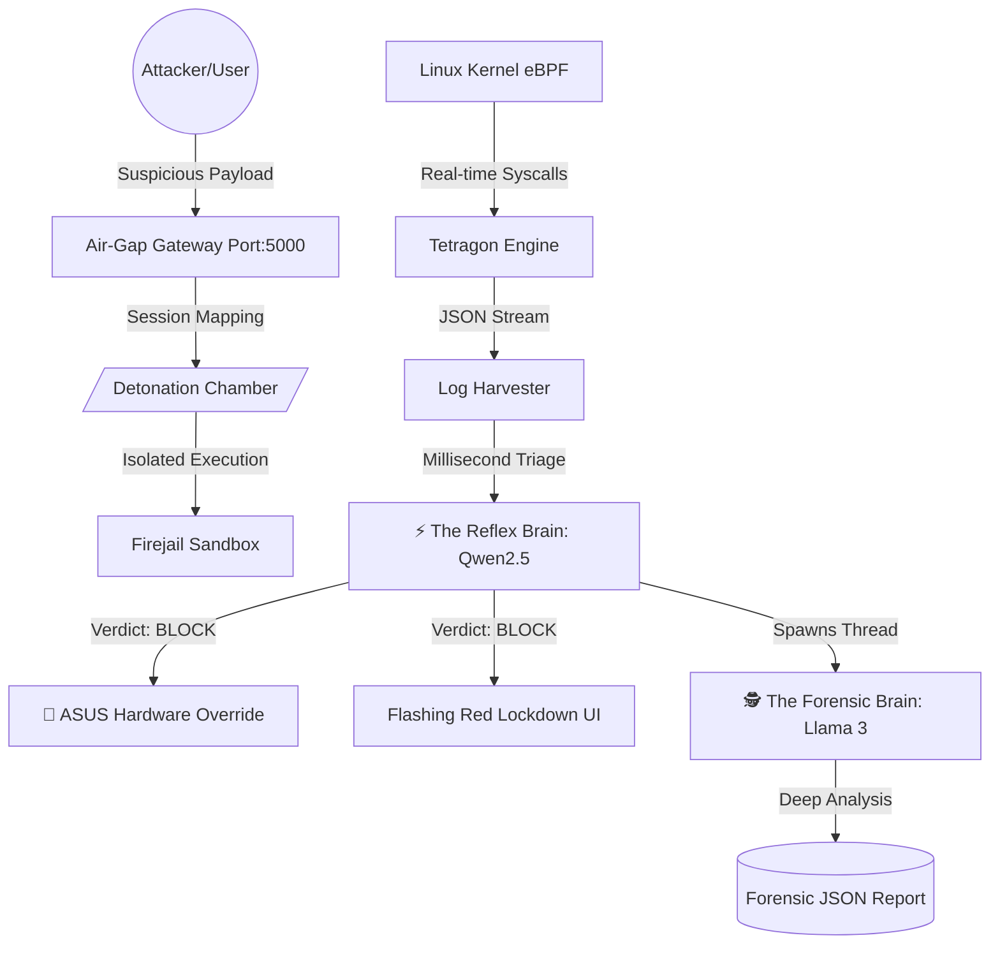

# 🛡️ Nexus-Cyber: AI-Powered Autonomous Security Stack


**Nexus-Cyber** is a fully autonomous, AI-driven XDR (Extended Detection and Response) daemon built exclusively for **ASUS TUF Gaming** laptops running **Pop!_OS**. It bridges the gap between deep-kernel observability, ruthless application sandboxing, and state-of-the-art dual-model Large Language Models (LLMs) to natively analyze, isolate, and physically respond to zero-day threats in real-time.

---

## 🏛️ The 5 Pillars of Nexus-Cyber (Core Architecture)

Nexus-Cyber isn't just a scanner; it's a multi-layered security engineering marvel designed for zero-trust environments.

### 🚪 1. The Air-Gap Gateway (Ingestion & Uploads)
Built on an advanced asynchronous **Flask/AJAX** backend, the web gateway handles incoming files without freezing the user interface. 
- **Session Mapping**: Crucially, it tracks the origin IP of every uploaded file (`session_map.json`). If a malicious file is uploaded, the resulting lockdown is *isolated to that specific user*. The system remains fully operational for other tenants, preventing denial-of-service via global lockdowns.

### 💣 2. The Detonation Chamber (Execution Isolation)
Uploaded files are never executed on the host. Nexus-Cyber delegates execution to heavily restricted **Firejail** sandboxes.
- **Lethal Environment**: The sandbox strips network access (`--net=none`) to prevent data exfiltration and restricts file system views (`--private`) to protect the host OS.
- **Time-Bomb Protocol**: Every detonation is governed by a strict 10-second timeout before the process is ruthlessly force-killed.

### 👁️ 3. The eBPF Senses (Kernel-Level Observability)
Static analysis isn't enough. Nexus-Cyber uses **Cilium Tetragon** to hook directly into the Linux kernel using eBPF, granting God-mode visibility into what the malware *actually* does:
- `sys_openat` and `sys_execve`: Catches ransomware attempting to encrypt files or payloads attempting fileless execution (`curl | bash`).
- `sys_connect`: Intercepts reverse shell attempts and data exfiltration outbounds.

### 🧠 4. The Dual-Brain AI (Cognitive Defense)
The pinnacle of Nexus-Cyber's architecture is its asynchronous, dual-model AI reasoning engine (`sentinel_brain.py`):
- ⚡ **The Reflex Brain (`qwen2.5-coder`)**: A deeply optimized, lightweight model that reads the raw eBPF JSON stream synchronously. It outputs a single decision: `BLOCK` or `ALLOW` within milliseconds, ensuring immediate threat containment.
- 🕵️ **The Forensic Brain (`llama3`)**: Running natively in a background Python `Thread`, Llama 3 deeply analyzes the isolated syscalls to generate a comprehensive, human-readable JSON forensic report (Timeline, Attack Vectors, Target IPs) without causing any UI or system latency.

### 🔴 5. The Hardware Feedback (Physical Alerting)
Breaking the digital barrier, Nexus-Cyber interfaces directly with **`asusctl`** (Aura Sync). 
- When the Reflex Brain detects a catastrophic threat, it instantly hijacks the laptop's physical keyboard RGB lighting, turning it a flashing **CRITICAL RED**. 
- The system visually screams at the engineer even if their terminal window is minimized.

---

## ☢️ Real-World Threat Simulation Suite
Nexus-Cyber comes equipped with `advanced_malware.sh`, a lethally engineered script designed to stress-test the AI's detection algorithms using professional APT (Advanced Persistent Threat) tactics:
1. **Reverse Shells**: Simulated remote access connection triggers via `/dev/tcp`.
2. **Fileless Execution**: In-memory payloads piped directly via `curl | bash`.
3. **Data Exfiltration**: Extracting `/etc/passwd` via HTTP POST.
4. **Crontab Persistence**: Injecting auto-start malware to survive reboots.

---

## 🛠️ Architecture Flow



---

## 📂 System Deployment (Ghost Mode)
Nexus-Cyber operates continuously as an autonomous **systemd daemon**, ensuring enterprise-grade persistence.

```bash
# Initialize Ghost Mode Deployment
chmod +x start_ghost.sh
sudo cp nexus-sentinel.service /etc/systemd/system/
sudo systemctl daemon-reload
sudo systemctl enable --now nexus-sentinel.service
```

---

## 🔒 Secure Admin Control Panel
A hard-coded, Basic-Auth authenticated dashboard (`/admin`) allows engineers to issue a **System Purge**:
- Wipes all forensic logs and active threat states.
- Cleans the quarantine directory.
- Resets ASUS RGB hardware back to safe mode (Blue).
- Includes an `emergency_reset.sh` CLI fallback for total system recovery.

---

## ⚖️ License & Disclaimer
This project is engineered for advanced security research, forensic demonstration, and ethical defense strategies. **Do not use in production without expert review.**

*Designed with precision.* 🛡️
