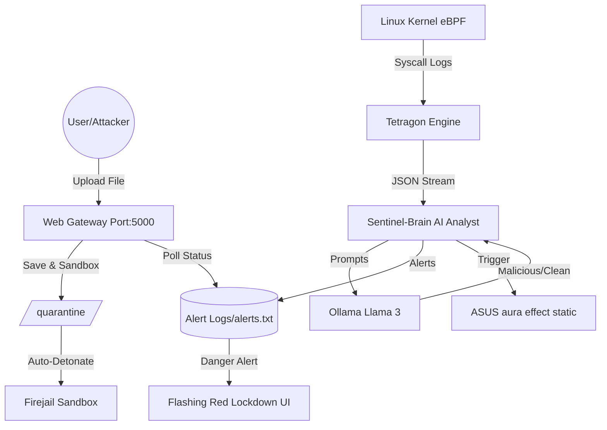

# 🛡️ Nexus-Cyber: AI-Powered Autonomous Security Stack


**Nexus-Cyber** is an advanced, autonomous security monitoring system designed for **ASUS TUF Gaming** laptops running **Pop!_OS**. It combines low-level kernel observability with modern Large Language Models (LLMs), sandboxed detonation, and physical hardware feedback to create a truly interactive defense environment.

---

## 🚀 Key Features

### 🔍 1. Tetragon eBPF Monitoring
The system hooks into the Linux kernel using **Cilium Tetragon**. It monitors critical syscalls in real-time:
- `sys_openat`: Tracking every file access attempt.
- `sys_connect`: Monitoring all outgoing network connections.
Logs are streamed in JSON format for instant AI processing.

### 🧠 2. Sentinel-Brain (AI Analyst)
The AI engine based on **Ollama (Llama 3)** that classifies events as `CLEAN` or `MALICIOUS`. It acts as the central command for both syscall logs and uploaded file analysis.

### 🚨 3. Hardware-Alert Sync
Integrated directly with **`asusctl`** (Aura Sync). If a threat is detected:
- 🔴 **Keyboard Glows Red**: Immediate physical feedback.
- 🔵 **Keyboard Returns to Blue**: Normal status restored.

### 🌐 4. Military Defense Dashboard (Real-Time UI)
A futuristic, military-style web portal built with **Tailwind CSS**.
- **Live Polling**: Frontend pings the backend every 2s for status updates.
- **Visual Alert**: If a breach occurs, the entire UI turns into a red-flashing **"SYSTEM LOCKED"** warning.

### ☢️ 5. Auto-Detonate (Sandboxing)
Every file uploaded remains isolated. The system automatically creates a **Firejail Sandbox**:
- **Network Isolation**: `--net=none` to prevent data exfiltration.
- **Restricted Access**: `--private` directory to protect the host OS.
- **Auto-Kill**: 10-second execution timeout before the process is force-killed.

### 🛡️ 6. Secure Admin Control Panel
A dedicated, authenticated dashboard (`/admin`) to manually clear threat states:
- **System Purge**: One-click reset to wipe forensic logs, clear quarantine, and reset hardware LEDs.
- **Basic Auth Protected**: Hardcoded military-grade password requirement.
- **Fallback**: Includes a local `emergency_reset.sh` script to force reset if the web UI is inaccessible.

### 👻 7. Ghost Mode (Automated Persistence)
Runs natively as a Linux **systemd daemon**. The system starts automatically at boot, ensuring your laptop is always protected.

---

## 🛠️ Architecture



---

## 📦 Requirements

- **OS**: Pop!_OS 24.04 (Noble) or Ubuntu-based.
- **Hardware**: ASUS TUF/ROG Laptop (for `asusctl`).
- **Tools**:
  - `ollama` (Llama 3)
  - `firejail` (Sandbox)
  - `tetragon` (eBPF)
  - `asusctl` (Hardware)

---

## 🚦 Deployment (Ghost Mode)

To set up Nexus-Cyber as an autonomous background service:

1. **Install Service**:
   ```bash
   chmod +x start_ghost.sh
   sudo cp nexus-sentinel.service /etc/systemd/system/
   ```

2. **Initialize Defense**:
   ```bash
   sudo systemctl daemon-reload
   sudo systemctl enable --now nexus-sentinel.service
   ```

3. **Monitor Activity**:
   ```bash
   # View AI internal logic
   tail -f logs/sentinel.log
   # View Web Gateway traffic
   tail -f logs/web.log
   ```

---

## 📂 Project Structure
```text
Nexus-Cyber/
├── web_gateway.py        # Flask UI & Sandbox Detonator
├── sentinel_brain.py     # AI Log Analyst & Hardware Sync
├── start_ghost.sh        # Background Daemon Script
├── nexus-sentinel.service# Systemd Service Definition
├── tetragon-policy.yaml  # eBPF Kernel Policy
├── templates/            # Cyber Dashboard (HTML/JS)
├── logs/                 # AI Alerts & Audit Logs
└── quarantine/           # Isolated Sandbox Directory
```

---

## ⚖️ License
This project is built for security research and ethical defensive demonstration. **Use responsibly.**

---

## 🛠️ Pengembangan Lanjutan (Future Roadmaps)
Berikut adalah rencana pengembangan untuk meningkatkan kemampuan Nexus-Cyber:
1. **Automated Containment**: Implementasi fitur *Auto-Kill* pada PID mencurigakan dan blokir IP via *Firewall* secara otomatis.
2. **Deep Forensic Sandbox**: Analisis trafik jaringan (`PCAP`) di dalam sandbox dan deteksi perubahan file sistem secara mendalam.
3. **Visualization 2.0**: Dashboard interaktif dengan peta serangan *Real-time* dan analitik riwayat ancaman.
4. **Hardware Safety**: Kontrol fan otomatis (Turbo Mode) dan *CPU Throttling* saat mendeteksi beban kerja ilegal (seperti cryptomining).
5. **Remote Alerts**: Integrasi Bot Telegram/Discord untuk notifikasi ancaman saat pengguna tidak berada di depan laptop.
6. **LLM Optimization**: Penggunaan model AI yang lebih ringan dan spesifik untuk keamanan guna meningkatkan kecepatan klasifikasi log.
